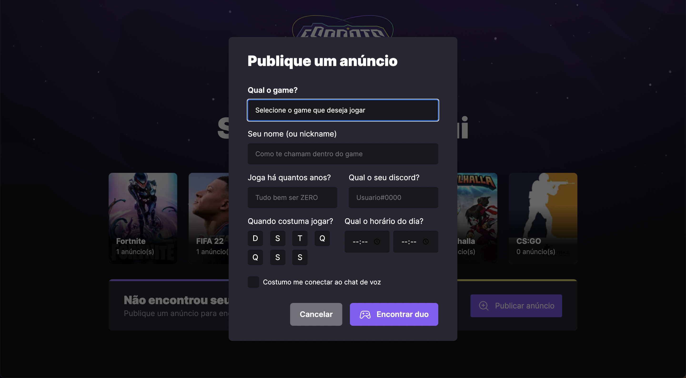
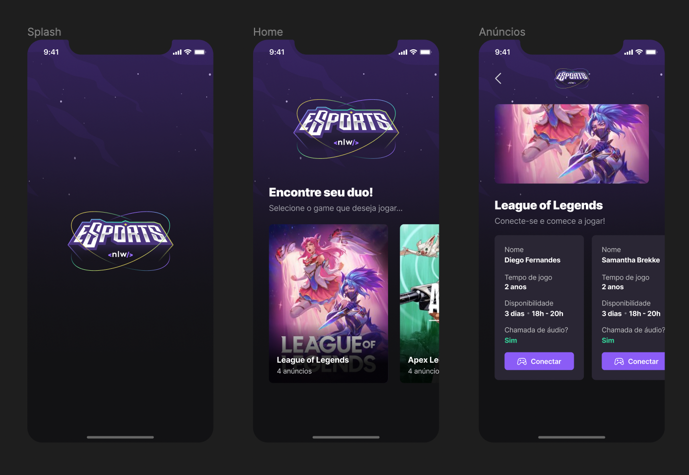

# NLW eSports

Projeto realizado durante a ***NLW eSports*** de uma aplicação para conectar gamers para jogar online. O projeto, construído tendo como linguagem o TypeScript, envolve o front-end com React, mobile utilizando o React Native, API feita no back-end por meio do Node.js, estilização com o framework Tailwind CSS, entre muitas outras tecnologias.

### 🛠 Tecnologias utilizadas 

- [TypeScript](https://www.typescriptlang.org/)
- [Node.js](https://nodejs.org/en/)
- [React](https://pt-br.reactjs.org/)
- [Expo](https://expo.dev/)
- [React Native](https://reactnative.dev/)
- [Vite](https://vitejs.dev/)
- [Tailwind CSS](https://tailwindcss.com/)
- [Prisma](https://www.prisma.io/)
- [Express](https://expressjs.com/)
- [Axios](https://axios-http.com/ptbr/)
- [Radix UI](https://www.radix-ui.com/)

<!-- ### ⚙️ Como rodar o projeto? 

Para executar o projeto, após clonar o repositório, comece entrando na pasta do projeto:

```
cd NLW_eSports
```

#### Server

Primeiramente, é necessário executar o servidor que contém os dados para a web e mobile. Para isso, entre na pasta `server` e instale as dependências do back-end:

```
cd server
npm install
```

Tudo pronto! Seu servidor já está configurado. Para executá-lo, basta rodar o comando: 

```
npm run dev
```

#### Web

Com o servidor  -->

### 📸 Preview do projeto

#### Web


<br>



<br>

#### Mobile



<hr>

<div align="center">Made with 🤍 by Viny</div>